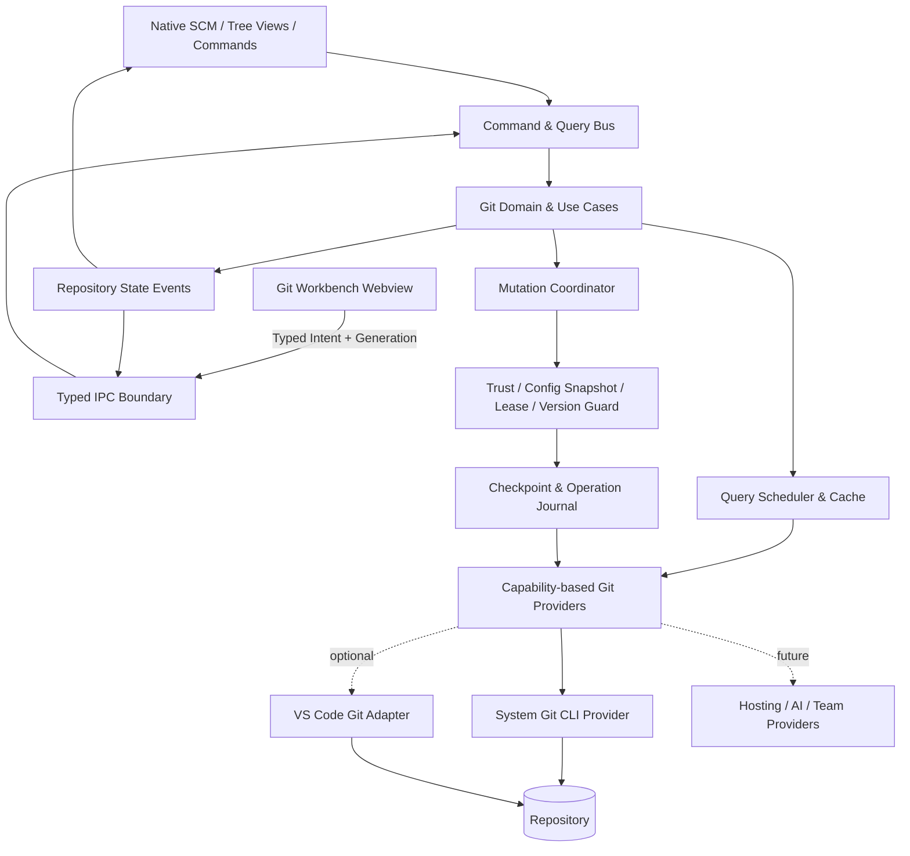

# Git Workbench VS Code 扩展设计规格

- 日期：2026-08-20
- 状态：交互与架构设计已确认，等待规格文档评审
- 工作名称：Git Workbench
- 配置命名空间：`gitWorkbench.*`
- 目标平台：macOS、Windows、Linux，以及 VS Code Remote SSH、WSL、Dev Containers

## 1. 产品摘要

Git Workbench 是一个面向普通开发者和中小团队的本地优先 Git 管理扩展。它把日常 Git 操作保留在熟悉的 VS Code 侧栏，把日志 DAG、跨分支比较、按 Hunk/行合入、历史改写和恢复放到编辑区中的 Git 工作台。

产品的核心价值不是“把更多 Git 命令放进菜单”，而是让用户在执行前看懂目标、影响与恢复方式，并在并发修改、Git 冲突、Hook 失败、网络结果未知或 VS Code 崩溃时保持可恢复。

首版完全本地运行。除用户主动操作 Git Remote 外，不上传源码、Diff、日志或仓库元数据。GitHub、GitLab、Gitee、AI 和团队协作仅保留受权限控制的 Provider 接口，不在 V1 实现。

## 2. 已确认的关键决策

| 决策 | 结论 |
|---|---|
| 目标用户 | 普通开发者与中小团队，复杂能力渐进呈现 |
| 运行场景 | 本地桌面、Remote SSH、WSL、Dev Containers；V1 不支持纯浏览器工作区 |
| 数据策略 | 本地优先；云端能力不实现，只预留接口 |
| Git 引擎 | 使用运行环境中的系统 Git，不捆绑 Git |
| 总体架构 | 系统 Git CLI 为完整能力来源，`vscode.git` 为可选协作适配器 |
| 主界面 | 渐进式双层：侧栏负责状态和导航，编辑区工作台负责复杂分析与操作 |
| 历史改写 | 安全模式：已发布历史二次确认、恢复检查点、精确 `force-with-lease` |
| 原子性 | 单次 Patch、纯文本 WorkspaceEdit 和 Ref 更新使用硬原子原语；多步操作提供可恢复事务 |
| 并发策略 | 乐观并发控制、仓库级写队列、版本向量、执行前重验与后置校验 |
| 性能策略 | 懒激活、流式解析、分页、虚拟化、有界并发、增量失效和大仓库降级 |
| Settings | 每项包含配置名、默认值、作用域、意义与枚举说明，并进入 VS Code Settings 描述 |

## 3. 目标与非目标

### 3.1 V1 目标

1. 支持任意 Commit、分支、Tag、Stash、Index 和工作区之间的比较。
2. 支持将文件、Hunk 或所选行安全应用到当前工作区、Index 或新 Worktree。
3. 完成 Add、Stage、Unstage、Commit、Amend、安全删除与恢复的日常闭环。
4. 完成 Fetch、Pull、Push 和 ahead/behind 预览。
5. 完成 Stash 的创建、预览、Apply、Pop、Drop 和从 Stash 创建分支。
6. 完成 Merge、Rebase、Cherry-pick、Revert、Pull 和 Stash Apply 的冲突解决闭环。
7. 提供 Log DAG、分支树、Tag、Stash、Worktree、Remote 和 WIP 状态。
8. 支持修改 HEAD 或历史 Commit 备注、Reset 到 Commit/分支、创建和切换分支。
9. 提供操作记录、恢复检查点、Reflog 恢复和崩溃续接。
10. 在 macOS、Windows、Linux 和选定 VS Code 远程场景中保持行为一致。

### 3.2 V1 非目标

- 不提供纯浏览器版 `vscode.dev` / `github.dev`。
- 不实现 PR/MR、Issue、CI 或托管平台账号集成。
- 不实现 AI 解释、AI Commit Message 或 AI 冲突解决。
- 不实现云端 Patch 分享、团队同步或遥测上传。
- 不取代 Git Hosting 服务端的分支保护和权限策略。
- 不承诺 Rebase、Reset 等多步文件系统操作具有物理上的单次原子性；它们采用检查点和补偿恢复。

## 4. 参考项目与借鉴边界

### 4.1 开源参考

- [VS Code 内置 Git](https://github.com/microsoft/vscode/tree/main/extensions/git)：仓库发现、SCM 模型、按行暂存、原生 Diff/Merge Editor 和扩展 API。
- [GitLens](https://github.com/gitkraken/vscode-gitlens)：Git 领域、CLI Provider、解析器、缓存、Webview IPC 和环境适配的分层方式。其 Plus 目录中的 Commit Graph 等非 OSS 代码不能复制。
- [Git Graph](https://github.com/mhutchie/vscode-git-graph)：任意两个 Commit 比较、WIP 节点、日志图上下文操作和大历史分页。
- [GitHub Desktop](https://github.com/desktop/desktop)：面向普通用户的提交工作流、错误表达和跨平台产品经验。
- [TortoiseGit](https://tortoisegit.org/docs/)：按块操作、Rebase 和特殊冲突类型的明确流程。

### 4.2 闭源产品的交互参考

- GitKraken：图上就地操作、筛选、变化规模提示和上下文详情。
- Fork：工作区、暂存区、Commit 的顺序，以及逐行 Stage 和可视化 Rebase。
- Tower：危险操作的统一撤销心智、拖放和恢复入口。
- Sourcetree：传统 Git GUI 中可发现的 Hunk 操作。

只借鉴公开可观察的交互规律，不复制品牌视觉、文案、图标、专有代码或受保护资产。

## 5. 产品交互架构

### 5.1 渐进式双层布局

侧栏只承担高频状态与导航：

- 当前仓库和当前分支；ahead/behind、进行中的 Git 操作。
- Changes、Staged Changes、Conflicts。
- Branches、Stashes、Worktrees、Remotes、Tags。
- “打开 Git 工作台”“操作记录”“恢复中心”。

编辑区 Git 工作台承担复杂任务：

- Commit DAG、WIP、Refs 和筛选。
- Commit/分支/工作区比较。
- 文件树、Hunk/行选择和合入目标。
- 历史改写计划、影响预览和旧 SHA → 新 SHA 映射。
- 操作详情、失败诊断与恢复路径。

文件精确编辑和冲突合并优先复用 VS Code 原生编辑器；Git 工作台提供只读的虚拟化 Diff/Hunk 预览，以支持会话级空白规则和按块操作。

### 5.2 统一操作入口

侧栏按钮、图上右键、编辑器标题按钮、命令面板和快捷键只负责构造领域意图。所有入口最终调用相同的 Command/Query 层、安全策略和事务协调器，不存在绕过检查的“快捷实现”。

### 5.3 术语

- Stage / Unstage：暂存 / 取消暂存。
- Stash / Apply / Pop：储藏 / 应用 / 弹出。
- Working Tree：工作区。
- Index：暂存区。
- Direct Diff：直接差异。
- Merge-base Diff：共同祖先以来的贡献。

界面不使用“暂存”同时表达 Stage 和 Stash。

## 6. 核心交互流程

### 6.1 任意端点比较

比较端点支持 Commit、Local/Remote Branch、Tag、Stash、HEAD、Index 和 Working Tree。用户可从日志图选择 A，再通过 Cmd/Ctrl 选择 B，也可使用上下文菜单“设为比较基线/目标”。工具栏始终显示 A、B、比较语义和交换按钮。

比较语义：

- `direct`：比较两个端点的完整树快照。
- `mergeBase`：比较共同祖先到目标端点的贡献。
- `auto`：Commit 对 Commit 使用 `direct`；分支对分支使用 `mergeBase`；涉及工作区时使用指定 Ref 到工作区的 `direct`。

比较结果显示 A/M/D/R/C/U、二进制、Submodule、LFS、文件模式和重命名相似度。用户可临时关闭重命名检测或切换空白规则。

### 6.2 本地与任意 Commit 比较

日志图顶部以 WIP 节点展示 Working Tree 和 Index。用户可以：

- 比较 `Commit ↔ Working Tree`。
- 比较 `Commit ↔ Index`。
- 分别查看 Staged 与 Unstaged 差异。
- 选择是否纳入 Untracked 文件；大仓库默认不深度扫描全部 Untracked 文件。

WIP 快照带 `repositoryGeneration`。工作区变化后旧比较会话显示“预览已过期”，刷新前禁止按旧 Hunk 写入。

### 6.3 按 Hunk/行合入

来源端点永远只读。目标必须是当前 Working Tree、Index 或显式创建的新 Worktree。系统不在后台切换当前分支，也不直接修改来源 Commit。

流程：

1. 用户选择文件、Hunk 或行。
2. 系统基于原始内容生成带上下文的最小 Patch。
3. 用户确认目标和方向；按钮使用“应用到工作区”“暂存此块”等明确文案。
4. Mutation Coordinator 重验 HEAD、Index、受影响文件内容和编辑器版本。
5. `git apply` 或纯文本 `WorkspaceEdit` 以全成或全败方式提交。
6. 后置状态验证通过后刷新 Diff；否则进入恢复流程。

不得使用 `git apply --reject`，不得生成无上下文 Patch。所选行无法形成安全 Patch 时，要求选择完整 Hunk 或进入手工编辑。

### 6.4 空白差异交互

`gitWorkbench.compare.ignoreWhitespace` 是新比较会话的默认值。Git 工作台工具栏提供始终可见的三态选择：

- `none`：显示全部空白差异。
- `eol`：忽略行尾空白。
- `all`：忽略所有空白变化。

工具栏修改仅影响当前比较会话。菜单提供“恢复 Settings 默认值”和“将当前值设为 User/Workspace/Folder 默认”。切换会清除已选择 Hunk/行并重新计算，防止旧行号继续应用。空白忽略只影响查看和 Hunk 分组；实际写入基于完整原始内容。

VS Code 原生 Diff 仅支持全局 `diffEditor.ignoreTrimWhitespace`，扩展不得暗中修改该值。“在原生 Diff 中打开”尊重用户现有 VS Code 配置。

### 6.5 Stage、Commit 与删除

- 支持文件、Hunk、选择行的 Stage/Unstage。
- Commit 面板按 Unstaged → Staged → Summary/Body 顺序展示。
- 默认不启用 Smart Commit；暂存区为空时不会自动 Stage 全部文件。
- 尊重 Commit Template、Hooks、GPG/SSH Signing 和 Git 用户配置。
- Hook 失败时保留 Hook 输出和其产生的工作区变化，不自动添加 `--no-verify`。
- Tracked 文件删除作为普通 Git Change Stage。
- 用户主动删除 Untracked 文件时，本地环境优先进入系统废纸篓，Remote 环境进入插件恢复区。
- 不提供默认不可恢复的 `git clean` 操作。

### 6.6 Fetch、Pull 与 Push

- Fetch、Pull、Push 分开呈现，不用含糊的单一 Sync 代替全部语义。
- Pull 前展示 Incoming/Outgoing Commit 和当前策略。
- `pull.strategy=inherit` 时读取 `pull.rebase`、`pull.ff`；均未配置则询问。
- Push 默认只允许快进更新。
- 改写已发布历史时，保存显式远端 OID，并使用 `--force-with-lease=<ref>:<expectedOid>`；不得依赖可能被后台 Fetch 改写的模糊 Lease。
- Push 结果未知时先用远端查询对账，绝不直接自动重试。
- 凭据交由系统 Git Credential Helper、SSH Agent 或安全 AskPass 桥接；插件不保存 Git 密码或令牌。

### 6.7 储藏

支持 Create、Preview、Apply、Pop、Drop 和 Create Branch From Stash。创建时明确选择 Untracked、Keep Index、Staged Only 和消息。Pop 发生冲突时保留 Stash，进入统一冲突流程；只有确认应用成功后才删除对应 Stash。

### 6.8 分支与 Worktree

支持创建、切换、重命名、删除和设置 Upstream。分支名先通过 Git 校验，不自行实现不完整的正则。

脏工作区切换策略：

- 保留修改并尝试切换。
- 创建具名 Stash 后切换。
- 为目标分支创建新 Worktree。
- 取消。

来源与目标分支、受影响文件和可能覆盖内容必须在确认前展示。

### 6.9 冲突解决

PausedOperation 模型覆盖 Merge、Rebase、Cherry-pick、Revert、Pull 和 Stash Apply。固定状态横幅显示操作类型、当前步骤、剩余 Commit、冲突数，以及 Continue、Skip、Abort。

- 文本冲突：VS Code 三方 Merge Editor。
- Delete/Modify：专用保留/删除选择。
- Binary：选择 Current、Incoming 或保存两份。
- Submodule：展示 Base、Current、Incoming OID 和可达关系。

Continue 前检查未合并 Index Stage、残留冲突标记和未 Stage 的解决结果。Abort 后验证仓库是否回到操作前状态。

### 6.10 修改 Commit 备注与历史改写

- HEAD 使用 Amend。
- 历史 Commit 使用受控 Interactive Rebase `reword` 计划。
- 计划展示所有被重写的后代、受影响分支、已发布状态、签名失效和需要的 Push 方式。
- 执行前要求工作区安全、创建恢复 Ref 和事务日志。
- 冲突时暂停到统一冲突流程。
- 完成后展示旧 SHA → 新 SHA 映射。

签名 Commit 被重写后原签名无效，界面必须明确说明，并根据 Git 配置重新签名或要求用户确认。

### 6.11 Reset 到 Commit 或分支

界面用结果解释模式，不只显示参数：

- Soft：移动分支，文件与 Index 保持不变。
- Mixed：移动分支，保留文件并取消暂存。
- Hard：移动分支，并将 Index/工作区还原到目标内容。

Hard 必须展示将丢弃的文件和行数、受保护分支状态、已发布状态与恢复检查点。默认推荐 Mixed，不默认推荐 Hard。

## 7. V1 功能范围

| 模块 | 功能 |
|---|---|
| 工作区变更 | Add、Stage/Unstage 文件/Hunk/行、Commit、Amend、安全删除、恢复、Ignore |
| 比较工作台 | 任意端点、直接/共同祖先差异、文件树、空白/重命名选项、原生 Diff 辅助入口 |
| 按块合入 | Working Tree、Index、新 Worktree 三种目标，原子 Patch 与过期保护 |
| 日志与引用 | DAG、Local/Remote Branch、Tag、Stash、Worktree、WIP、搜索与过滤 |
| 分支 | 创建、切换、重命名、删除、Upstream 和脏工作区策略 |
| 远端 | Fetch、Pull、Push、ahead/behind、Pull 策略、安全强推 |
| 储藏 | Create、Preview、Apply、Pop、Drop、Create Branch |
| 冲突 | Merge/Rebase/Cherry-pick/Revert/Pull/Stash，Continue/Skip/Abort |
| 历史 | Reword、Interactive Rebase、Revert、Cherry-pick、Reset |
| 恢复 | Operation Journal、Checkpoint、Reflog、崩溃恢复、诊断 |
| 兼容 | Multi-root、Remote SSH、WSL、Dev Containers、Hooks、Signing、LFS/Submodule 感知 |

V1.x 可增加托管平台、AI、团队共享、Stacked Branch、高级 Submodule/LFS 管理和纯浏览器 Provider。

## 8. VS Code Settings 合同

所有设置必须在 `contributes.configuration` 中提供 `type`、`default`、`scope`、范围或枚举约束、`markdownDescription` 和 `markdownEnumDescriptions`，并在 `package.nls.json` 与 `package.nls.zh-cn.json` 本地化。自动测试必须保证运行时默认值、Manifest Schema 和文案不漂移。

### 8.1 通用与界面

| 配置名 | 默认值 | 作用域 | Settings 描述 |
|---|---:|---|---|
| `gitWorkbench.git.path` | `""` | Machine / Remote | Git 可执行文件路径。空值表示优先继承 VS Code 的 `git.path`，否则使用当前运行环境中的系统 Git。工作区不能设置该值。 |
| `gitWorkbench.repositories.autoDetect` | `"openFolders"` | Window | 仓库发现范围：`openFolders` 仅检测已打开 Folder；`subFolders` 扫描子目录；`off` 仅使用手动仓库。不会扫描整个磁盘。 |
| `gitWorkbench.repositories.scanDepth` | `2` | Window | `subFolders` 模式的最大扫描层级，范围 1–5。数值越大，打开大型目录时扫描成本越高。 |
| `gitWorkbench.ui.followActiveRepository` | `true` | Window | 多仓库工作区中自动跟随当前编辑文件所属仓库；关闭后固定用户选择。 |
| `gitWorkbench.ui.compactMode` | `"auto"` | Window | `auto` 根据宽度调整；`compact` 减少行高和次要信息；`comfortable` 保留完整信息。 |

### 8.2 日志图

| 配置名 | 默认值 | 作用域 | Settings 描述 |
|---|---:|---|---|
| `gitWorkbench.graph.pageSize` | `200` | Resource | 每次加载的 Commit 数量，范围 50–1000；不限制历史总量。 |
| `gitWorkbench.graph.maxLanes` | `50` | Resource | 同时绘制的最大分支轨道数；超过后折叠远轨道以限制布局成本。 |
| `gitWorkbench.graph.order` | `"topo"` | Resource | `topo` 保持拓扑；`date` 按提交时间；`authorDate` 按作者时间。 |
| `gitWorkbench.graph.showWorkingTree` | `true` | Resource | 在日志图顶部显示 Working Tree、Index 和未提交修改节点。 |
| `gitWorkbench.graph.showRemoteBranches` | `true` | Resource | 显示远端跟踪分支。 |
| `gitWorkbench.graph.showTags` | `true` | Resource | 显示 Tag。 |
| `gitWorkbench.graph.showStashes` | `true` | Resource | 显示 Stash。 |
| `gitWorkbench.graph.showWorktrees` | `true` | Resource | 显示关联 Worktree 及其脏状态。 |

### 8.3 比较与应用

| 配置名 | 默认值 | 作用域 | Settings 描述 |
|---|---:|---|---|
| `gitWorkbench.compare.defaultMode` | `"auto"` | Resource | `auto` 对 Commit 使用 Direct、对分支使用 Merge-base、涉及工作区时使用 Direct；也可固定 `direct` 或 `mergeBase`。实际模式始终显示。 |
| `gitWorkbench.compare.ignoreWhitespace` | `"none"` | Resource | `none` 显示全部；`eol` 忽略行尾；`all` 忽略全部空白。只影响查看，不改变实际 Patch。工作台可会话级快捷覆盖。 |
| `gitWorkbench.compare.renameDetection` | `"auto"` | Resource | `auto` 在性能预算内检测；`on` 始终尝试；`off` 关闭。降级时明确显示新增/删除。 |
| `gitWorkbench.compare.maxFileSizeMB` | `10` | Machine / Remote | 可生成完整文本 Diff 的单文件大小上限；超过后只显示元数据与统计。 |
| `gitWorkbench.compare.maxDiffLines` | `20000` | Machine / Remote | 单个 Diff 首次渲染的最大行数；超过后按块加载并关闭非必要装饰。 |
| `gitWorkbench.apply.defaultTarget` | `"prompt"` | Resource | `prompt` 每次询问；`worktree` 写当前工作区；`index` 只写暂存区；`newWorktree` 在新 Worktree 应用。 |

### 8.4 工作流

| 配置名 | 默认值 | 作用域 | Settings 描述 |
|---|---:|---|---|
| `gitWorkbench.commit.smartCommit` | `false` | Resource | 暂存区为空时是否自动 Stage 全部已跟踪修改。默认关闭，防止未审阅内容进入 Commit。 |
| `gitWorkbench.pull.strategy` | `"inherit"` | Resource | `inherit` 使用 Git 配置，未配置则询问；可选 `prompt`、`ffOnly`、`merge`、`rebase`。 |
| `gitWorkbench.fetch.prune` | `"inherit"` | Resource | `inherit` 使用 Git 配置；`on` 清理失效远端跟踪 Ref；`off` 禁用。不会删除本地分支。 |
| `gitWorkbench.remote.autoFetch` | `false` | Resource | 是否后台 Fetch。只更新远端跟踪 Ref，不自动 Pull、Merge 或改工作区。 |
| `gitWorkbench.remote.autoFetchIntervalMinutes` | `10` | Resource | 自动 Fetch 间隔，最小 5 分钟；失焦、休眠或写操作时暂停。 |
| `gitWorkbench.branch.dirtyWorktreeStrategy` | `"prompt"` | Resource | `prompt` 询问；`keep` 保留修改；`stash` 创建具名储藏；`newWorktree` 创建新 Worktree。 |
| `gitWorkbench.stash.includeUntracked` | `false` | Resource | 创建 Stash 时默认是否包含 Untracked；执行前仍显示实际范围。 |
| `gitWorkbench.conflict.autoOpen` | `"prompt"` | Resource | `prompt` 询问；`first` 自动打开首个文本冲突；`never` 只显示横幅和列表。 |

### 8.5 安全与恢复

| 配置名 | 默认值 | 作用域 | Settings 描述 |
|---|---:|---|---|
| `gitWorkbench.safety.mode` | `"balanced"` | User + Resource | `balanced` 保持普通操作短路径，危险操作预览和检查点；`strict` 增加确认并禁止改写已发布历史。各作用域取更严格值。 |
| `gitWorkbench.safety.protectedBranches` | `["main","master","release/*"]` | User + Resource | 受保护分支 Glob。正常 Commit/快进 Push 可用；删除、Reset、Rebase、历史改写和强推加强校验。各作用域取并集。 |
| `gitWorkbench.safety.publishedRewrite` | `"confirm"` | User + Resource | `deny` 禁止已发布历史改写；`confirm` 展示影响、二次确认并只允许精确 Lease。无“始终允许”。 |
| `gitWorkbench.safety.checkpointRetentionDays` | `30` | Machine / Remote | 恢复检查点保留天数，范围 1–365；只清理插件内部恢复数据。 |
| `gitWorkbench.safety.checkpointMaxCount` | `50` | Machine / Remote | 每仓库恢复检查点上限；超过后清理最旧且未固定的检查点。 |

### 8.6 性能与诊断

| 配置名 | 默认值 | 作用域 | Settings 描述 |
|---|---:|---|---|
| `gitWorkbench.performance.profile` | `"auto"` | Machine / Remote | `auto` 根据仓库规模和 Git 延迟调整；`balanced` 保留更多信息；`largeRepository` 优先性能。 |
| `gitWorkbench.performance.maxCacheMB` | `150` | Machine / Remote | 插件全局内存缓存上限；超过后 LRU 清理非活动仓库、旧 Diff 和日志页。 |
| `gitWorkbench.performance.maxConcurrentReads` | `4` | Machine / Remote | 全局只读 Git 进程上限，范围 1–8；每仓库最多两个读任务，写操作始终串行。 |
| `gitWorkbench.logging.level` | `"error"` | User | 本地日志级别：`off/error/warn/info/debug/trace`。Trace 也不得记录文件内容、Diff、令牌或凭据。 |
| `gitWorkbench.diagnostics.redactPaths` | `true` | User | 导出诊断时隐藏用户名、绝对路径、URL 凭据和可识别项目的信息。 |

### 8.7 不可配置的安全不变量

- 旧预览或旧版本向量不能写入。
- 不提供普通 `--force`。
- 危险操作前必须建立可用检查点。
- 不自动删除外部 Git Lock。
- 不静默跳过 Hooks。
- 不用旧全文件快照覆盖更新内容。
- 不在未信任工作区执行写操作或网络操作。

## 9. 总体技术架构

### 9.1 包与组件边界

| 组件 | 职责 | 依赖 |
|---|---|---|
| `packages/domain` | 不可变 Git 模型、Use Cases、错误类型、策略接口 | 无 VS Code、Node 或 UI 依赖 |
| `packages/git-cli` | Git 进程执行、能力探测、流式解析、命令 Provider | Node `child_process`、domain 接口 |
| `packages/transactions` | 版本向量、写租约、检查点、Journal、恢复协调 | domain、storage、git providers |
| `packages/config` | Settings Schema、作用域解析、严格度合并、配置快照 | VS Code Adapter 接口 |
| `packages/protocol` | Webview IPC DTO、Schema、协议版本 | 纯 TypeScript |
| `src/extension` | 激活、Repository Registry、VS Code Commands/Views、Storage | VS Code API、上述 packages |
| `webview/workbench` | DAG、比较、Hunk、历史计划和设置快捷控件 | protocol；不得导入 Host 模块 |
| `webview/graph-worker` | 图布局与大数据计算 | 纯计算，无文件/网络权限 |

任何组件不得通过读取另一个组件的内部文件绕过接口。Webview 不接收凭据；不需要时也不接收绝对路径。

### 9.2 Extension Host 位置

Manifest 使用 `extensionKind: ["workspace"]`。本地仓库在本地 Node Extension Host 运行；Remote SSH、WSL 和 Dev Container 在远端 Workspace Extension Host 运行。Git、文件系统、Operation Journal 和恢复快照都位于仓库所在环境。Webview 仍由 VS Code UI 承载，通过 VS Code 消息通道通信。

### 9.3 System Git CLI Provider

- 使用 `spawn(gitPath, args, options)`，禁止拼接 Shell 字符串。
- 所有 Ref 和 Path 参数用 `--end-of-options`、`--` 和固定参数位置隔离。
- 机器输出使用 Porcelain、明确 `--format` 和 NUL 分隔。
- 流式解析 stdout/stderr，设置字节上限，不使用无界 `maxBuffer`。
- 读命令关闭 Pager；不调用 Git Alias。
- Untrusted Workspace 中禁用外部 Diff、TextConv、FSMonitor 和任何网络/写命令。
- 不直接依赖 `.git/refs` 文件结构，以兼容 Packed Refs、Worktree 和 Reftable。
- OID 使用不定长模型，兼容 SHA-1 和 SHA-256。

### 9.4 `vscode.git` 可选适配器

可复用仓库发现、状态事件和认证交互，但核心能力不能依赖未公开 API。适配器缺失或内置 Git 被禁用时，CLI Provider 仍支持全部本地功能。冲突时以当前实际 Git 状态为权威，不以某个 Adapter 缓存为权威。

### 9.5 未来 Provider 接口

按 `RemoteHostingProvider`、`AiProvider`、`PatchSharingProvider` 拆分。接口必须声明权限、数据分类、网络域名和可取消性；V1 不注册任何实现。未来 Provider 只能通过 Redaction/Consent 层取得用户明确选择的内容。

## 10. 读写数据流

### 10.1 Query

1. UI 发 Query，并带 Repo ID、参数和 requestId。
2. Query Bus 校验 Schema 和 Workspace Trust。
3. Repository Registry 解析真实仓库，Configuration Service 生成只读配置。
4. Scheduler 复用或取消同类请求，并受全局/仓库读并发限制。
5. Provider 流式解析结果，Cache 以 `repositoryGeneration + queryKey` 缓存。
6. Extension Host 只发送增量 DTO；Webview 虚拟化展示。

Query 被取消不改变仓库。未知解析字段被忽略并记录兼容性诊断；关键格式无法识别时降级只读，不猜测结果。

### 10.2 Mutation

1. UI 发送领域 Intent、Repo ID、会话基线，不发送任意 Git Args。
2. Command Bus 校验 Intent、信任状态、参数和功能能力。
3. Use Case 生成 Operation Plan、影响预览和期望后置状态。
4. 用户确认后获取仓库写租约并冻结配置快照。
5. 重验版本向量、Git Lock 和 PausedOperation。
6. 写入 Checkpoint 和 Durable Journal。
7. 执行最小 Git 原语；冲突时进入 Paused 状态。
8. 验证后置状态；成功 Commit Journal，失败 Rollback 或 Needs Attention。
9. 增加 `repositoryGeneration`，精确失效缓存并向 UI 发送增量。

## 11. 原子性与并发安全

### 11.1 版本向量

每个写计划至少包含：

- `repositoryGeneration`。
- HEAD OID、当前 Branch/Symref 和目标 Ref OID。
- Index Fingerprint；存在 Unmerged Stage 时使用完整 Stage 列表指纹。
- PausedOperation 类型与步骤。
- 受影响文件的 Content Hash、Mode、存在状态。
- 已打开文档的 `TextDocument.version` 和 Dirty 状态。

文件监听只负责让预览尽快失效。最终正确性依赖执行前重新读取和比较版本向量。

### 11.2 仓库级调度

- 每仓库最多一个写操作。
- 每仓库最多两个读操作；全局默认最多四个。
- 写操作优先于新后台读请求。
- 不抢占外部 `index.lock`，不删除未知 Lock。
- 外部 Git 操作导致状态变化时，当前计划返回 `STALE_PLAN`。

### 11.3 保证等级

| 操作 | 保证 |
|---|---|
| 单/多 Hunk Patch | `git apply` 默认全成或全败；不使用 `--reject` |
| 纯文本多文档编辑 | VS Code WorkspaceEdit 全成或全败；仅使用最小 TextEdit |
| Stage/Unstage | Git Index Lock + 基线校验 |
| 单/多 Ref 更新 | `update-ref` expected old OID；多 Ref 使用 `--stdin` 事务 |
| Reset/Rebase/历史改写 | Checkpoint + Durable Journal + PausedOperation + 补偿恢复 |
| Push | 服务端快进规则或显式 expected OID Lease；未知结果先对账 |

### 11.4 并发文件修改

- VS Code 中 Dirty 文档通过编辑器模型应用最小 Edit，插件不主动 Save。
- 磁盘和编辑器缓冲区同时变化时暂停，交由 VS Code 文件冲突流程。
- 发现内容 Hash 或文档版本不一致，禁用旧确认按钮。
- 用户可“刷新并重新预览”“在新内容上重新套用”“导出 Patch”，不存在“仍然覆盖”。
- 执行中发生外部变化且后置校验失败时，状态为 Needs Attention，不宣称成功、不自动重试。

## 12. Checkpoint、Journal 与恢复

### 12.1 存储

- Ref 状态使用 `refs/git-workbench/recovery/<operation-id>/<label>`，通过 expected old OID 安全创建。
- 受影响的 Dirty/Untracked 文件使用二进制安全、内容寻址的本地恢复快照。
- Journal、快照和索引保存在 Extension `globalStorageUri` 的仓库哈希目录；Remote 场景存于远端 Extension Host。
- 恢复数据不参与 Settings Sync、不上传网络；本地权限限制为当前用户。
- 清理由保留天数和每仓库数量共同控制；固定的检查点不自动清理。

### 12.2 Journal 状态

`Planned → Preflight → Checkpointed → Running → Paused/Verifying → Committed`

失败分支为 `RollingBack → RolledBack` 或 `NeedsAttention`。每次状态变更采用临时文件写入、Flush 和原子 Rename。启动时不只相信 Journal，而是读取 HEAD、Refs、Index 和 Git 操作标记进行 Reconcile。

### 12.3 恢复中心

展示操作名称、时间、仓库、旧/新 Ref、影响文件、状态和可用动作：Continue、Abort、Restore Checkpoint、Open Diagnostics、Pin、Delete Recovery Data。删除恢复数据必须二次确认，并明确其不可恢复性。

## 13. 错误模型与鲁棒性

核心错误码：

- `STALE_PLAN`：预览或版本向量过期。
- `REPOSITORY_LOCKED`：外部 Git Lock 或其他写操作。
- `WORKSPACE_UNTRUSTED`：受限模式禁止当前动作。
- `CONFLICT_PAUSED`：Git 操作已暂停等待解决。
- `POSTCONDITION_FAILED`：命令退出后实际状态与计划不符。
- `AUTH_REQUIRED`：系统凭据交互未完成。
- `UNSUPPORTED_GIT_CAPABILITY`：当前 Git 缺少能力。
- `PARSER_UNSUPPORTED`：关键机器输出无法安全解析。
- `TOO_LARGE`：内容超过交互预算。
- `CORRUPT_REPOSITORY`：对象、Index 或 Ref 损坏。
- `CANCELLED`：只读任务安全取消。

错误必须包含 Operation ID、用户可理解的说明、仓库是否变化、可否重试、建议动作和脱敏诊断入口。

### 13.1 重试规则

- 只读、幂等、瞬时失败的 Query 最多自动重试两次，并指数退避。
- 所有写操作、Fetch/Pull/Push、Hook 和认证失败不盲目自动重试。
- 写结果未知时先 Reconcile，再决定是否提供重试。
- 取消写操作不能简单 Kill Git；只在安全阶段终止，否则等待 Git 进入可 Abort 状态。

### 13.2 降级

- Graph 渲染失败时退化为可搜索 Commit 列表。
- 超大 Diff 退化为统计和按文件打开。
- 未识别 Git 输出时停止 Mutation，保留只读诊断。
- Event Storm 时熔断后台刷新，切换为可见的手动刷新。
- Built-in Git Adapter 失败时使用 CLI Provider。

## 14. 安全模型

### 14.1 Workspace Trust

Manifest 声明 `untrustedWorkspaces.supported: "limited"`。未信任工作区只提供受限只读浏览；禁用写、网络、Hooks、外部 Diff/TextConv、FSMonitor 和工作区自定义可执行路径。相关 Settings 加入 `restrictedConfigurations`。

### 14.2 命令与路径安全

- Webview 输入经 JSON Schema 验证。
- 不接受任意 Git 子命令、Args 或 Shell 片段。
- 使用 URI、规范化后的 Repo-relative Path 和 Git `--` 分隔。
- 拒绝越出 Worktree 的 Patch Path、绝对 Path 和危险 Symlink 路径。
- Branch、Tag、Commit Message 和文件名作为不可信数据转义；Webview 使用严格 CSP，不使用未清洗 `innerHTML`。

### 14.3 数据与隐私

- 遥测默认不存在，而不是“默认关闭后仍捆绑上传 SDK”。
- 日志不记录源码、Diff、凭据、Token 或完整环境变量。
- 诊断默认脱敏绝对路径、用户名和带凭据 Remote URL。
- 未来 Provider 凭据使用 SecretStorage；不得进入 Settings、workspaceState 或日志。
- Recovery Snapshot 是本地源码副本，必须在 UI 中说明位置、保留期限和清理方式。

### 14.4 供应链

- 锁定依赖并生成 SBOM。
- VSIX 不包含未声明的可执行文件。
- 禁止安装时脚本下载二进制。
- 依赖更新执行 License、Vulnerability 和 Bundle Diff 检查。

## 15. 性能设计

### 15.1 预算（参考机 P95）

| 指标 | 目标 |
|---|---:|
| 冷激活扩展自有同步 CPU | `< 100 ms` |
| 普通仓库首屏状态 | `< 700 ms`，100 ms 内显示骨架 |
| 10 万提交仓库首批 200 行日志 | `< 1 s`，存在 Commit Graph |
| 本地 UI 操作反馈 | `< 100 ms` |
| 日志滚动帧 | `< 16.7 ms` |
| 全局缓存硬上限 | 默认 `150 MB` |

参考大仓库为 25 万 Working Tree 文件、100 万 Commit。首屏超过 2 秒时自动进入大仓库降级。

### 15.2 手段

- 按 Command/View 懒激活，启动不扫描仓库。
- `git status --porcelain=v2 -z --branch` 等稳定机器格式。
- 日志首批 200、增量加载；Graph DOM 不超过约 300 行。
- Git stdout 流式解析；Webview 只接收增量 splice/DTO。
- Graph 布局放 Web Worker；不可见视图停止刷新。
- Cache 以 generation 和 query 参数键控，LRU 回收。
- File/Git Events 合并，避免 Status Storm。
- 大仓库关闭头像、完整 Untracked 扫描和昂贵 Rename Detection。
- 后台 Auto Fetch 默认关闭。

## 16. 跨平台与兼容性

- VS Code 基线：`>= 1.96.0`；测试最低版、Stable 和 Insiders。
- Git 基线：`>= 2.35.3` 或带等效安全补丁的发行版。
- 启动时探测具体 Git Capability，不以版本字符串猜测功能。
- macOS：Apple Silicon、Intel，大小写敏感/不敏感文件系统。
- Windows：Windows 10/11、Git for Windows、长路径、盘符、UNC、CRLF。
- Linux：Ubuntu/Debian、RHEL 系、Alpine Container，x64/arm64。
- Remote：WSL2、Remote SSH、Debian/Alpine Dev Container。
- Repository：普通、Shallow、Partial Clone、Sparse Checkout、Worktree、Submodule、LFS、Detached HEAD、Unborn Branch、SHA-1/SHA-256。

路径一律通过 VS Code URI 和 Git pathspec 处理，不手写 `/` 与 `\\` 拼接。大小写重命名在不敏感文件系统使用安全临时名两步法，并纳入恢复记录。

## 17. 测试策略

| 层级 | 覆盖 |
|---|---|
| Unit | Domain、Settings 合并、安全策略、状态机、Patch、错误分类 |
| Parser | 真实样本、NUL、Unicode、换行文件名、未知字段、Fuzz/Property Tests |
| Git Integration | 临时真实仓库中的所有读写、冲突、Worktree、恢复 |
| VS Code Integration | Commands、Views、Settings、Trust、SecretStorage、Diff/Merge |
| Webview | DAG、Hunk、Whitespace、IPC、键盘、可访问性 |
| E2E | 打开仓库到比较、应用、Commit、Push、冲突与恢复完整流程 |
| Fault Injection | 每个 Journal 状态点强杀、I/O 错误、Lock、Hook、网络、并发变化 |
| Performance | 10 万/100 万 Commit、25 万文件、10 Repo、高延迟 SSH、大 Diff |

特殊测试必须覆盖中文、Emoji、空格、Tab、换行文件名，仅大小写重命名、Symlink、Executable Bit、CRLF/LF、Binary、LFS、Submodule、Hook 修改工作区、Signing、恶意 Ref/Message/Path 和 Webview XSS。

## 18. 发布门槛

1. 所有 V1 核心流程有端到端用例。
2. 支持矩阵通过真实 Git 集成测试。
3. 写操作故障注入不产生未报告的部分成功。
4. 崩溃后能 Continue、Rollback、Restore 或明确 Needs Attention。
5. 性能达到预算；不达标时自动降级且 UI 可操作。
6. 键盘可完成全部核心流程；支持高对比度和屏幕阅读器。
7. Settings 的配置名、默认值、作用域、意义和枚举描述完整，中英文本地化。
8. VSIX 通过 SBOM、依赖审计和内容检查。
9. Preview 通道通过后才进入 Stable；配置、Journal 与 Recovery 数据迁移向后兼容。

## 19. 用户需求映射

| 原始需求 | 设计落点 |
|---|---|
| 不同 Commit 跨分支比较 | 任意端点比较、Direct/Merge-base 两种语义 |
| 本地与某 Commit 跨分支比较 | WIP/Index 节点与任意 Ref 比较 |
| 按块/行合入 | Git 工作台 Hunk/行选择、三种目标、原子 Patch |
| Add/Commit/Delete | Stage/Commit/Amend、安全删除与恢复 |
| Pull/Push | 预览、策略、凭据复用、结果对账 |
| 暂存和弹出 | Stage/Unstage 与 Stash/Apply/Pop 分词设计 |
| 冲突解决 | PausedOperation + 原生三方 Merge + 特殊冲突分流 |
| Log 树、分支树 | DAG、Refs、WIP、Stash、Worktree、搜索过滤 |
| 修改某次提交备注 | Amend 或受控 Interactive Rebase Reword |
| 重置到某个分支 | Soft/Mixed/Hard 结果解释、影响预览和 Checkpoint |
| 创建、切换分支 | Upstream、脏工作区策略与新 Worktree |
| 操作原子性 | Patch/WorkspaceEdit/Ref 原子原语与可恢复事务 |
| 外部并发修改保护 | 版本向量、执行前重验、STALE_PLAN、无覆盖按钮 |
| 插件性能 | 明确 P95 预算、分页、虚拟化、流式、有界调度、降级 |
| 失败鲁棒性 | Typed Errors、Journal、Reconcile、故障注入、禁止盲重试 |
| VS Code Settings | 完整配置合同与工作台会话级快捷覆盖 |

## 20. 设计完成判定

本规格中列出的功能边界、数据流、安全不变量、配置合同、性能预算、错误策略和测试门槛共同构成实现验收依据。实现计划不得把原子性、并发保护、恢复、Settings 文案或跨平台测试作为“后续优化”移出 V1。
